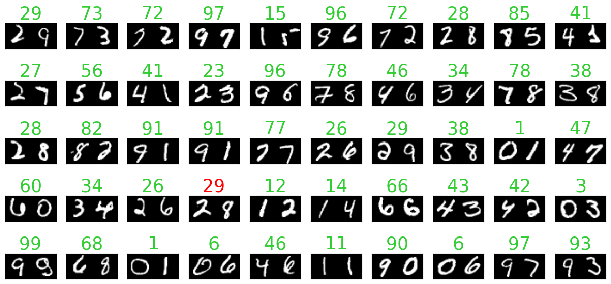

# Numbers recognition


## Overview

This project aims to build a neural network that can recognize handwritten numbers from images.
The project is designed for educational purposes, and leaves freedom of adjusting the parameters to the user, such as:
- the numbers of digits the model has to recognize
- the data augmentation parameters
- the number of layers of the convolutional neural networks
- the training parameters

and many more.

## Prerequisites

- Python 3.8 or above
- TensorFlow 2.x
- NumPy
- Matplotlib (for visualization)

## Installation

Clone the repository to your local machine:

```bash
git clone https://github.com/Marcolino97do/Numbers_Recognition.git
```
Install the required packages:
```bash
pip install -r requirements.txt
```
Enter the source folder:
```bash
cd Numbers_Recognition/source
```
Execute the main.py file:
```bash
python3 main.py
```
After the first run, feel free to play with the parameters in the config module, 
and experiment with new modalities.

## Dataset Creation
The dataset is created using the MNIST dataset, which is a dataset of handwritten digits.
After downloading the dataset fo single digits, the images are combined to create images with multiple digits.
Once a dataset is created, it is stored in the data folder, and can be retrieved for faster future use.


